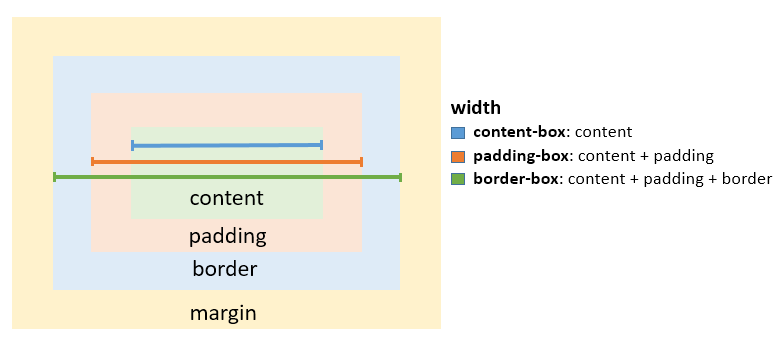

# 1. 背景
参考教程中 react 实战来构建的例子 3
重新再次搭建项目

# 2. 总结
+ 实际上 useState useEffect 基本能解决99%的问题，就是可能性能会差一些

+ 亮点是什么？
具备⼀定的思考、技术难度、解决了关键问题。
• 基于业务，封装公共能⼒，解决业务中的标准问题，并推⼴派⽣；
• 使⽤⼯程化⼿段，解决⼀类流程或研发逻辑、标准的问题；
• 你搞了⼀个东西，这个东西之前⾏业没有，并解决了问题。

+ webpack 的优化不是亮点，因为 webpack 已经做得很好了，没什么可以优化的空间了，无非就是那些 分包、压缩、构建优化、打包优化--并行构建、分析包体积，哪些包排除出去，没啥了

+ monorepo
多个项⽬⽤⼀个代码库来管理依赖关系

+ react 官方文档地址：
https://zh-hans.react.dev/

# 3. 准备工作
## 3.1 创建项目 monorepo

### 3.1.1 总项目 初始化
pnpm init - 总项目的初始化
总项目名加上 scope，如 @john/zhihu-demo

### 3.1.2 创建子目录
packages/apps - 多个应用
packages/components - 跨项目的组件
packages/libs - 跨项目的库

### 3.1.3 创建 pnpm-workspace.yaml
该文件是用于配置和管理使用 pnpm 包管理器的多包仓库的工作空间
``` javascript
// pnpm-workspace.yaml
packages: 
  - "packages/**"
```

### 3.1.4 创建子项目： 工具
创建 libs/text-util
pnpm init - 创建子项目的初始化，注意加 scope，如 @john/text-util
index.js 里创建一个函数，用于测试
package.json 里添加: "type": "module",

### 3.1.5 创建子项目： 应用
创建 apps/text-pro
pnpm init - 创建子项目的初始化，注意加 scope，如 @john/text-pro
index.js 里创建一个函数，用于测试
package.json 里添加: "type": "module",

### 3.1.6 建立子项目之间的引用关系： @john/text-pro 引用 @john/text-util
回到总的项目根目录，输入如下命令
pnpm add workspace:@john/text-util@1.0.0 -F @john/text-pro
项目 @john/text-pro 的 package.json 里出现 "@john/text-util": "workspace:^"
项目 @john/text-pro 的 node_modules 里出现 @john/text-util 的硬链接
在项目 @john/text-pro 中引用@john/text-util: import {getNameFromJohn} from '@john/text-util';
运行 @john/text-pro 可进行验证

## 3.2 安装相关需要依赖的开发工具库
### 3.2.1 eslint - 代码质量检查工具
eslint 主要用于监测 JavaScript 代码质量。
+ 它可以检查代码中的潜在问题，如未使用的变量、未定义的引用、不必要的括号等，从而帮助开发者提升编码能力。
+ 统一开发者的编程风格，确保团队成员遵循一致的代码规范。

项目根目录中执行：
pnpm add eslint -D -w
npx eslint --init

由于 -w 的问题，需要⼿动安装
pnpm add @typescript-eslint/eslint-plugin@latest @typescript-eslint/parser@latest -D -w

此时能在项目根目录下发现文件 eslint.config.mjs

由于一些未知原因，eslint 配置文件不能正常运行，需要全局安装如下内容，否则 eslint.config.mjs 会报错
```
Error [ERR_MODULE_NOT_FOUND]: Cannot find package 'globals' imported from E:\web-learn\code\john-github\2024-0705-zhihu-react\eslint.config.mjs
```
pnpm install globals -w
pnpm install typescript-eslint -w

### 3.2.2 Prettier - 代码格式化工具
Prettier是一个代码格式化工具，它专注于代码的外观，自动调整代码格式，使其符合预设的规范和风格。
当ESLint和Prettier同时使用时，为了避免冲突，通常需要配置ESLint以禁用与Prettier冲突的规则，或者使用eslint-config-prettier等配置来确保两者之间的和谐共存。

+ 项目根目录中执行：
pnpm add prettier -D -w

+ 新建⼀个 .prettierrc.json 的配置，写⼀下
{
    "printWidth": 80,
    "tabWidth": 2,
    "useTabs": true
}

+ 应先安装 VS Code 的插件： ESLint 和 Prettier

+ prettier 可能和 eslint 有冲突
pnpm add eslint-plugin-prettier eslint-config-prettier -D -w

### 3.2.3 安装 typescript
#### 3.2.3.1 创建 react 项目 react-master
mkdir packages/apps/react-master
cd packages/apps/react-master
pnpm init
修改 package.json 中项目名，加入 scope，名字为 @john/react-master

// 创建 tsconfig.json
tsc --init  

// 根据教程对 tsconfig.json 做修改

#### 3.2.3.2 到项目根目录去安装一些插件
pnpm add @typescript-eslint/eslint-plugin -D -w

#### 3.2.3.3 修改根目录下的 eslint.config.mjs
``` javascript
import globals from "globals";
import pluginJs from "@eslint/js";
import tseslint from "typescript-eslint";
// import prettier from "eslint-config-prettier";
// import eslintPluginPrettier from "eslint-plugin-prettier";

export default [
  {
    languageOptions: {
      globals: { ...globals.browser, ...globals.node }
    },
    rules: {
      "semi": ["error", "always"],
      "no-var": "error",
    },
    // 添加插件到 plugins 键
    // 注意：这里不再定义 "@typescript-eslint" 插件
    plugins: {
      // "@typescript-eslint": {}, // 这行被移除
      "prettier": {}
    },
  },
  pluginJs.configs.recommended,
  ...tseslint.configs.recommended, // 确保这里不会重复定义 "@typescript-eslint"
];
```

### 3.2.4 安装 react
#### 3.2.4.1 安装依赖项
项目根目录下执行：
pnpm add webpack webpack-cli webpack-merge webpack-dev-server babel-loader @babel/core @babel/preset-react @babel/preset-env @babel/preset-typescript style-loader css-loader less less-loader postcss postcss-loader tailwindcss autoprefixer html-webpack-plugin css-minimizer-webpack-plugin terser-webpack-plugin mini-css-extract-plugin cross-env -D --filter @john/react-master

pnpm add react react-dom @types/react @types/react-dom --filter @john/react-master

#### 3.2.4.2 通过脚手架新建一个 react 项目 (用于参考)
从根目录开始
cd packages/apps
npx create-react-app demo

// 观察 webpack 的配置
npm run eject

#### 3.2.4.3 配置 webpack 
在项目目录下创建目录 scripts ，在其中放入3个 webpack 配置文件：
webpack.base.js
webpack.dev.js
webpack.prod.js

#### 3.2.4.4 创建几个相关的配置文件
.babelrc
.postcssrc.js

#### 3.2.4.5 创建 Html 模板文件
public/index.html

#### 3.2.4.6 配置编译脚本
在 package.json 中添加如下内容：
``` json
"scripts": {
		"build": "webpack -c scripts/webpack.prod.js",
		"start": "webpack-dev-server --config scripts/webpack.dev.js"
}
```

#### 3.2.4.7 创建项目的入口文件
src/index.tsx
src/App.tsx

#### 3.2.4.8 配置 live server
+ 启动 live server 时，root 路径不是根目录，而是 /packages/apps/react-master/dist/
+ 应在 .vscode/settings.json 中添加如下内容：
``` json
{
    "liveServer.settings.root": "/packages/apps/react-master/dist/"
}
```
+ vs code 中启动和关闭 live server
在 vs code 最下的状态栏中，点击左下角的图标(Go Live)，即可启动 live server
点击 live server 图标（Port:5500），即可关闭 live server

#### 3.2.4.9 项目的编译和开发环境运行
+ 在 /packages/apps/react-master/ 执行：
    pnpm run build
+ 使 live server 启动
+ 访问地址：http://localhost:5500/

#### 3.2.4.10 css 模块文件的定义
+ 创建 global.d.ts 文件，在其中声明全局的 css 模块
+ 创建 app.module.css 文件，在其中定义全局的 css 类
+ 在代码中 引入 css 模块，并使用 css 模块中的类名

#### 3.2.4.11 tailwind 相关配置
+ tailwind.config.js
+ index.less
+ 在代码中导入： import "./index.less"
+ 代码中尝试 tailwind

#### 3.2.4.12 安装 vs code 的插件
+ ES7+ React/Redux/React-Native snippets
+ Tailwind CSS IntelliSense

### 3.3 路由
pnpm add react-router-dom --filter @john/react-master

#### 3.3.2 React Router 文档
https://reactrouter.com/en/main  -- 英语，官方
http://www.reactrouter.cn/docs/ -- 中文

# 4. 开发
## 4.1 开发目标说明
### 4.1.1 开发目标
模仿知乎网站首页的布局，实现一个简单的知乎首页
https://www.zhihu.com/

### 4.1.2 开发项目(monorepo 结构中的子项目)
packages/apps/react-master

## 4.2 开发步骤
### 4.2.1 创建子目录
在 src 目录下新建4个子目录，分别用于存放`组件、页面、路由、工具`
```
// /src/ 下的文件和目录
dist
public
scripts
src/components -- 组件
src/pages -- 页面
src/router -- 路由
src/utils -- 工具
.babelrc
.postcssrc.js
package.json
tailwind.config.js
tsconfig.json
```

### 4.2.2 创建路由相关文件
+ 创建文件 src/router/index.tsx
+ 创建相关页面，使各个路由跳转都正常显示
+ 子路由需要在页面上定义 <Outlet />
+ 使用了 HashRouter
```
http://localhost:3000/
http://localhost:3000/#/hot
http://localhost:3000/#/explore

http://localhost:3000/#/education
http://localhost:3000/#/education/learning

http://localhost:3000/#/question
http://localhost:3000/#/question/waiting
```

### 4.2.3 首页的制作
#### 4.2.3.1 首页中的组件创建 - 大框架，细节稍后处理
+ 创建组件：src/components/navigation/index.tsx  -- 顶部导航栏
+ 创建组件：src/components/card/index.tsx

#### 4.2.3.2 CSS 概念梳理 - 盒模型
##### 4.2.3.2.1 CSS Box Model


##### 4.2.3.2.2 CSS Box Model 的区别


+ w3c 标准盒模型：
盒子总宽度 = width + padding + border + margin
盒子总高度 = height + padding + border + margin

+ ie 盒模型：
盒子总宽度 = width + margin
盒子总高度 = height + margin

##### 4.2.3.2.3 box-sizing


box-sizing: content-box|border-box|inherit

+ content-box 默认值，元素的 width/height 不包含padding，border，与标准盒子模型表现一致
+ border-box 元素的 width/height 包含 padding，border，与怪异盒子模型表现一致
+ inherit 指定 box-sizing 属性的值，应该从父元素继承

#### 4.2.3.3 NavLink 组件
+ 在React Router库中，NavLink 是一个用于导航的组件，它允许你在应用中创建链接。
+ NavLink 与普通的 <a> 标签或 <Link> 组件相似，但它添加了一些额外的功能，比如基于当前URL自动设置active样式类，这使得它非常适合用于导航菜单或标签页等场景。
+ <a> 标签在默认情况下会导致页面刷新，而 NavLink 和 React Router 一起工作，实现了客户端的路由跳转，不会触发页面刷新

#### 4.2.3.4 导航页面细化 - 首页第一行
+ 子组件 Logo
+ 子组件 NavTab
+ 子组件 Search
+ 子组件 MenuAlarm

+ 安装依赖 @headlessui/react @heroicons/react ，用于UI开发
pnpm add @headlessui/react @heroicons/react --filter @john/react-master

#### 4.2.3.5 页面细化
+ 子组件 Card
+ 子组件 Tabs

#### 4.2.3.5 推荐内容
+ 子组件 CommandList
+ mock 数据
+ css 中 sticky 属性的应用

#### 4.2.3.5 其他组件
+ 子组件 AdvancedBtns
+ 子组件 Creation
+ 子组件 SelfFunctions

### 4.2.4 进一步的功能开发
#### 4.2.4.1 滚动区域判断
+ IntersectionObserver 是一个强大的API，它提供了一种高效、异步的方法来监测元素与视窗的交叉状态，为开发者实现各种交互效果和性能优化提供了便利。随着浏览器对 IntersectionObserver API 的支持度不断提高，它已经成为现代网页开发中不可或缺的一部分。

